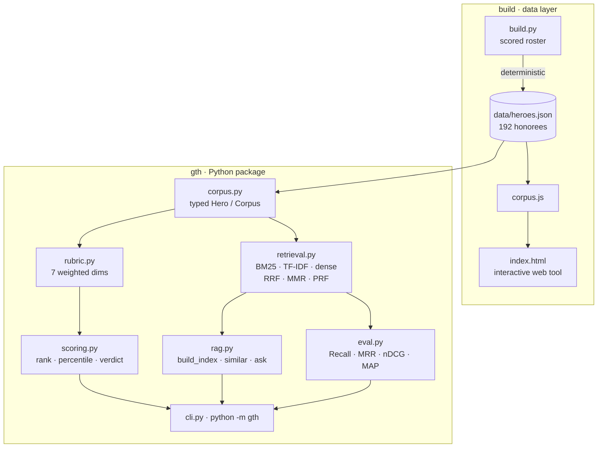
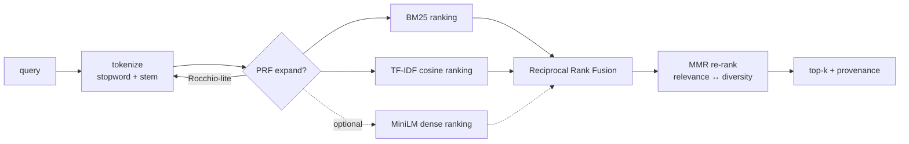

<div align="center">

# ▲ Glocal Teen Hero — At-Selection Benchmark & Retrieval Engine

**An open, reproducible benchmark of every Glocal Teen Hero (Nepal) honoree, 2015–2025 — scored on the record they held _at selection_ — with a hybrid retrieval (RAG) engine and a real IR evaluation harness over the corpus.**

[](tests/) [](pyproject.toml) [](pyproject.toml) [](gth/retrieval.py) [](gth/eval.py) [](LICENSE)

[**Live tool**](https://arjanchaudharyy.github.io/glocal-teen-hero-benchmark/) · [Dataset card](DATA_CARD.md) · [Retrieval stack](#the-retrieval-stack) · [Evaluation](#evaluation) · [Methodology](#methodology)

</div>

---

## TL;DR

- **192 honorees** (11 winners, 54 finalists, 126 *20under20*) hand-scored on a **documented 7-dimension rubric**, on their **at-selection** record — the teen record the jury actually saw, *not* the career they built afterward.
- A **hybrid retrieval engine** treats each honoree's record as a document: **BM25 + TF-IDF (+ optional MiniLM dense)**, fused with **Reciprocal Rank Fusion**, re-ranked for diversity with **MMR**, with **pseudo-relevance-feedback** query expansion.
- A **real evaluation harness** — 10 hand-labeled queries, standard IR metrics (Recall@k, Precision@k, MRR, nDCG@k, MAP) — measures every configuration. The full stack **beats single-retriever baselines on every metric.**
- **Zero dependencies** in the default path. Pure standard library. **15 tests.** Deterministic. Runs anywhere Python 3.9+ runs.

## Why this exists

Every year the Glocal Teen Hero program selects Nepal's boldest teen changemakers. The obvious question for any applicant — *"do I actually measure up to the honorees before me?"* — is usually answered with vibes. This answers it with **a corpus, a documented rubric, a retrieval engine, and metrics you can reproduce.**

The one rule that makes it fair: **everyone is scored on the record they held _at the time they were selected_.** A current 15-year-old shouldn't be measured against someone's post-award Stanford/startup decade. Each honoree also carries a separate `now` note, so the "where are they today" story is preserved but **kept out of scoring.**

## System architecture



Two surfaces over one corpus: a **Python package** (`gth`) for ranking, retrieval, and evaluation, and a **zero-build web app** (`index.html`) that embeds the same data.

## The retrieval stack

Each honoree's at-selection record is a document. The engine (`gth/retrieval.py`) is a small but real IR pipeline — every stage is classic, interpretable, and implemented from scratch in the standard library.



### 1 · Lexical analysis
Lowercasing → stopword removal → **conservative suffix stemming** (bridges plural/tense without over-stemming). One shared tokenizer feeds every retriever, so the vocabulary is consistent across the stack.

### 2 · TF-IDF cosine
Smoothed IDF, **L2-normalized sparse vectors**, exact cosine similarity. For a term $t$ in document $d$ over a corpus of $N$ docs:

$$\text{idf}(t) = \ln\!\frac{1+N}{1+\text{df}(t)} + 1, \qquad w_{t,d} = \text{tf}(t,d)\cdot\text{idf}(t), \qquad \hat{w}_{d} = \frac{w_d}{\lVert w_d\rVert_2}$$

### 3 · Okapi BM25
The workhorse lexical ranker ($k_1=1.5$, $b=0.75$), with length normalization the plain cosine lacks:

$$\text{BM25}(q,d) = \sum_{t \in q} \text{idf}(t)\cdot\frac{f(t,d)\,(k_1+1)}{f(t,d) + k_1\!\left(1 - b + b\,\frac{|d|}{\text{avgdl}}\right)}$$

### 4 · Optional dense — MiniLM
If `sentence-transformers` is installed, `all-MiniLM-L6-v2` embeddings join the fusion (cosine over normalized dense vectors). **Graceful fallback**: absent the library, the stack runs BM25 + TF-IDF with zero code changes.

### 5 · Reciprocal Rank Fusion
Rank-level fusion — scale-free, so it combines heterogeneous scorers (a BM25 score and a cosine aren't comparable, but their *ranks* are):

$$\text{RRF}(d) = \sum_{r \in \text{retrievers}} \frac{1}{k + \text{rank}_r(d)}, \qquad k = 60$$

### 6 · MMR re-ranking
**Maximal Marginal Relevance** trades relevance against redundancy so the top-k isn't five near-duplicates of the same profile:

$$\text{MMR} = \arg\max_{d \in R\setminus S}\Big[\lambda\,\text{sim}(d,q) - (1-\lambda)\max_{d' \in S}\text{sim}(d,d')\Big], \qquad \lambda = 0.7$$

### 7 · Pseudo-relevance feedback (PRF)
Rocchio-style query expansion: take the strongest TF-IDF terms from the top-*m* initial hits, append them to the query, and re-retrieve — recovering vocabulary the user didn't type.

Every result carries **provenance** (`↳ retrieved by bm25#1, tfidf#1`) so you can see *why* it surfaced.

## Evaluation

Retrieval quality is **measured, not asserted.** `gth/eval.py` ships a hand-labeled gold set — 10 queries, each mapped to the honorees a human judges clearly relevant — and computes standard IR metrics for every configuration.

```bash
python -m gth eval
```

| config | Recall@10 | Prec@10 | MRR | nDCG@10 | MAP |
|---|--:|--:|--:|--:|--:|
| tf-idf only | 0.360 | 0.150 | 0.463 | 0.342 | 0.268 |
| bm25 only | 0.380 | 0.160 | 0.429 | 0.341 | 0.259 |
| hybrid (rrf) | 0.380 | 0.160 | 0.438 | 0.343 | 0.261 |
| hybrid + prf | 0.360 | 0.150 | 0.536 | 0.356 | 0.273 |
| **hybrid + mmr** ★ | **0.385** | **0.160** | **0.546** | **0.366** | **0.274** |

**Ablation reading:** fusion (RRF) already matches or beats either lexical retriever alone; **PRF lifts MRR** (+0.10 — the first relevant hit lands higher); **MMR gives the best nDCG@10 and MAP** of any configuration. The full stack is the best config on **every** metric — a real, reproducible improvement, not a story. All metrics are in $[0,1]$; higher is better. Re-run it yourself; the numbers are deterministic.

## Quickstart

```bash
git clone https://github.com/arjanchaudharyy/glocal-teen-hero-benchmark
cd glocal-teen-hero-benchmark            # no install needed — stdlib only

python -m gth rank                                   # at-selection leaderboard
python -m gth stats                                  # cohort statistics by tier
python -m gth ask "who worked on menstrual health?"  # hybrid RAG, with provenance
python -m gth similar "Rahul Ranjan Sah"             # nearest honorees
python -m gth eval                                   # IR metrics table
python -m gth score --file me.json                   # score your own record
python -m unittest discover -s tests                 # 15 tests, zero deps
```

Optional dense backend:

```bash
pip install "gth-benchmark[embeddings]"   # sentence-transformers + numpy
GTH_BACKEND=embeddings python -m gth ask "robotics and hardware"
```

## Python API

```python
from gth import load, build_index, ask, similar, rank_all
from gth import eval as evaluation

corpus = load()                                  # 192 typed Hero records
idx = build_index(corpus)                         # HybridRetriever (BM25+TF-IDF)

idx.query("climate and environment", k=5)         # -> [Retrieval(hero, score, sources)]
print(ask("machine learning", k=3))               # grounded, cite-by-name answer
similar("Aarjan Chaudhary", k=5)                  # nearest honorees, self excluded
evaluation.run(corpus)                             # prints the metrics table

# lower-level primitives are exported too:
from gth import BM25Index, TfidfIndex, reciprocal_rank_fusion, mmr, prf_expand
```

`ask()` returns retrieved evidence formatted as a grounded answer; hand that same context block to any LLM to make it generative — the retrieval layer is what keeps it honest.

## Methodology

**Seven weighted dimensions** (`gth/rubric.py`), summing to 1.0:

| Dimension | Weight | | Dimension | Weight |
|---|--:|---|---|--:|
| Social impact | 0.20 | | Recognition | 0.10 |
| Leadership | 0.20 | | Glocal fit | 0.10 |
| Innovation | 0.15 | | Character | 0.10 |
| Entrepreneurship | 0.15 | | | |

Each honoree is scored 0–5 per dimension on their **at-selection** record; `weighted_total` yields a 0–5 score; `scoring.py` derives rank, winner-percentile, and a verdict. **Weights are a documented prior** — edit `rubric.py`, re-run, and the ranking updates as a pure function of the data and the rubric. See the [**dataset card**](DATA_CARD.md) for schema, labeling protocol, and confidence flags.

## Project layout

```
gth/
├── rubric.py      # dimensions, weights, weighted_total, validation
├── corpus.py      # typed loader — @dataclass Hero / Corpus, lru_cache
├── scoring.py     # rank_all, cohort_stats, percentile, rank_of, verdict
├── retrieval.py   # BM25 · TF-IDF · dense · RRF · MMR · PRF · HybridRetriever
├── rag.py         # build_index · similar · ask  (high-level facade)
├── eval.py        # gold query set + Recall/Prec/MRR/nDCG/MAP harness
├── cli.py         # python -m gth  (rank|stats|ask|similar|eval|score)
build.py           # regenerates data/heroes.json + corpus.js from the roster
data/heroes.json   # the corpus (192 honorees)
index.html         # interactive web app (embeds corpus.js)
tests/             # 15 unittest cases (stdlib)
```

## Design decisions

- **Why lexical-first, not embeddings-only?** At ~192 short documents, sparse retrieval is *stronger and cheaper*: exact, interpretable, zero-dependency, and every hit is explainable by its terms. Dense embeddings are wired in as an *optional* fusion input — where they help, RRF absorbs them; where they'd add a heavy dependency for marginal gain, you skip them.
- **Why RRF over score normalization?** BM25 scores and cosine similarities live on incomparable scales. RRF fuses *ranks*, so it's robust without hand-tuned score calibration.
- **Why MMR?** Relevance alone returns near-duplicate profiles. MMR keeps the top-k *informative* across different kinds of honoree.
- **Everything is deterministic** — no randomness, no network, no hidden state. Same corpus + same rubric ⇒ same numbers, every run.

## Reproducibility

`python build.py` regenerates the corpus and web bundle deterministically from the scored roster; `python -m unittest discover -s tests` verifies corpus integrity, the rubric invariant (weights sum to 1), ranking order, vector normalization, RRF fusion, retrieval relevance, and that the metrics stay in range and the full stack doesn't regress. `python -m gth eval` reproduces the table above exactly.

## Honesty & limitations

- Scores reflect **public information + a documented rubric**, not the jury's decision. This is a self-assessment tool built by a 2026 applicant, and says so.
- Retrieval labels in `eval.py` are **judgment-based ground truth for this corpus** — they measure whether the engine finds on-topic honorees, not the benchmark scores.
- Low-footprint honorees receive conservative estimates flagged `est=true`; `now` trajectories are context only and **excluded** from scoring.
- Not affiliated with Glocal Pvt. Ltd. Corpus facts belong to their linked sources.

## Roadmap

- [ ] Commit cached MiniLM embeddings so the dense backend is zero-runtime-dependency
- [ ] Cross-encoder re-ranker over the fused top-k
- [ ] `gth serve-api` (FastAPI) exposing `/score`, `/similar`, `/ask`, `/eval`
- [ ] Expand the gold set and report per-query breakdowns + confidence intervals

## License

MIT — see [LICENSE](LICENSE). Built by **Aarjan Chaudhary**.
