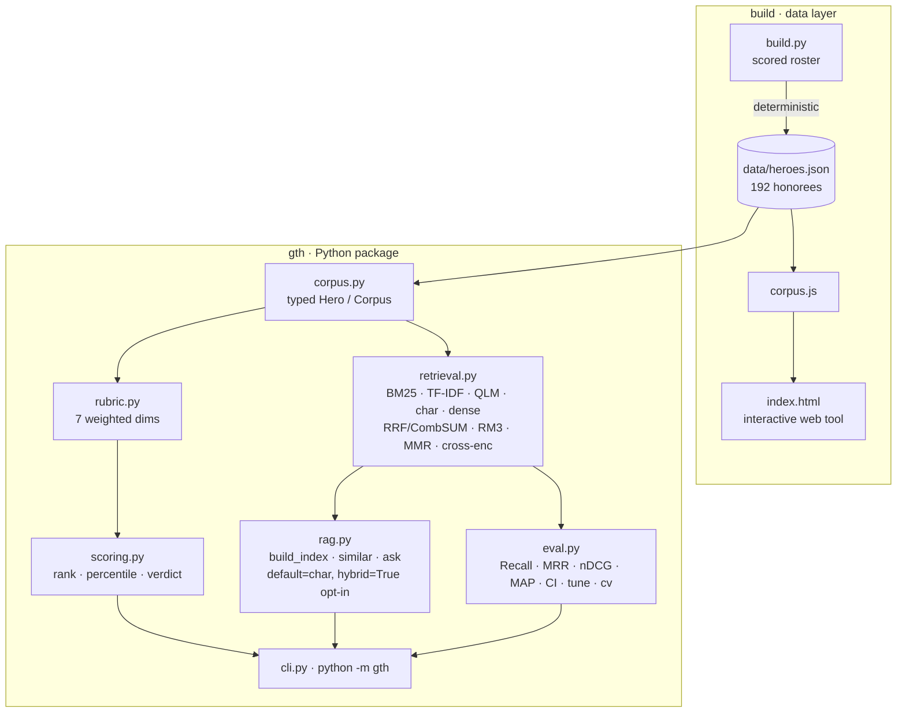
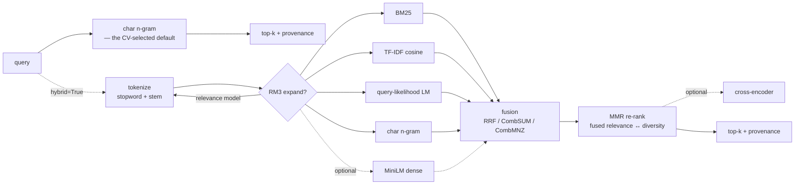

<div align="center">

# ▲ Glocal Teen Hero — At-Selection Benchmark & Retrieval Engine

**An open, reproducible benchmark of every Glocal Teen Hero (Nepal) honoree, 2015–2025 — scored on the record they held _at selection_ — with a hybrid retrieval (RAG) engine and a real IR evaluation harness over the corpus.**

[](tests/) [](pyproject.toml) [](pyproject.toml) [](gth/retrieval.py) [-0.578-6aa9d8)](gth/eval.py) [](gth/eval.py) [](LICENSE)

[**Live tool**](https://arjanchaudharyy.github.io/glocal-teen-hero-benchmark/) · [**Paper**](PAPER.md) · [Dataset card](DATA_CARD.md) · [Retrieval stack](#the-retrieval-stack) · [Evaluation](#evaluation) · [Cross-validation](#cross-validation--proving-the-default-instead-of-guessing-it) · [Methodology](#methodology)

</div>

---

## TL;DR

- **192 honorees** (11 winners, 54 finalists, 126 *20under20*) hand-scored on a **documented 7-dimension rubric**, on their **at-selection** record — the teen record the jury actually saw, *not* the career they built afterward.
- A **full IR retrieval engine** treats each honoree's record as a document: **five retrievers** (BM25, TF-IDF cosine, query-likelihood LM, character n-gram, + optional MiniLM dense), **three fusion strategies** (RRF, CombSUM, CombMNZ), **RM3 relevance-model** query expansion, and **MMR** diversity re-ranking — with an optional neural **cross-encoder**.
- A **real evaluation harness** — 39 hand-labeled queries, standard IR metrics (Recall@k, Precision@k, MRR, nDCG@k, MAP), **bootstrap 95% CI**, per-query breakdown, and a **grid-search tuner**.
- **A 5-fold cross-validation harness picks the shipped default** — not the eval table. It caught real overfitting: the elaborate BM25+TF-IDF+char+RM3+MMR ensemble looks best when tuned and measured on the same queries, but **plain character n-gram retrieval wins on held-out queries in all 5 folds.** So that's what ships as the default; the full ensemble is real, tested, and available behind one flag (`hybrid=True`) — we just don't pretend it's the better default when the evidence says otherwise.
- **Zero dependencies** in the default path. Pure standard library. **23 tests.** Fully **deterministic** (verified across hash seeds). Runs anywhere Python 3.9+ runs.

## Why this exists

Every year the Glocal Teen Hero program selects Nepal's boldest teen changemakers. The obvious question for any applicant — *"do I actually measure up to the honorees before me?"* — is usually answered with vibes. This answers it with **a corpus, a documented rubric, a retrieval engine, and metrics you can reproduce.**

The one rule that makes it fair: **everyone is scored on the record they held _at the time they were selected_.** A current 15-year-old shouldn't be measured against someone's post-award Stanford/startup decade. Each honoree also carries a separate `now` note, so the "where are they today" story is preserved but **kept out of scoring.**

## System architecture



Two surfaces over one corpus: a **Python package** (`gth`) for ranking, retrieval, and evaluation, and a **zero-build web app** (`index.html`) that embeds the same data.

## The retrieval stack

Each honoree's at-selection record is a document. The engine (`gth/retrieval.py`) is a real IR pipeline — every stage is classic, interpretable, and implemented from scratch in the standard library. **All of it is real and callable**; which pieces run *by default* is decided by [cross-validation](#cross-validation--proving-the-default-instead-of-guessing-it), not by how sophisticated they sound.



### 1 · Lexical analysis
Lowercasing → stopword removal → **conservative suffix stemming** (bridges plural/tense without over-stemming). One shared tokenizer feeds the word-level retrievers; a separate **character n-gram** analyzer (3–4 grams) powers typo/transliteration-robust matching — which matters for Nepali names and romanized spellings.

### 2 · TF-IDF cosine
Smoothed IDF, **L2-normalized sparse vectors**, exact cosine. For term $t$ in doc $d$ over $N$ docs:

$$\text{idf}(t) = \ln\!\frac{1+N}{1+\text{df}(t)} + 1, \qquad w_{t,d} = \text{tf}(t,d)\cdot\text{idf}(t), \qquad \hat{w}_{d} = \frac{w_d}{\lVert w_d\rVert_2}$$

### 3 · Okapi BM25
The workhorse lexical ranker (tuned $k_1=1.5$, $b=0.4$), with the length normalization plain cosine lacks:

$$\text{BM25}(q,d) = \sum_{t \in q} \text{idf}(t)\cdot\frac{f(t,d)\,(k_1+1)}{f(t,d) + k_1\!\left(1 - b + b\,\frac{|d|}{\text{avgdl}}\right)}$$

### 4 · Query-likelihood LM (Dirichlet)
A probabilistic ranker — rank $d$ by the likelihood it generated the query, smoothed against the corpus model $P(t\mid C)$ ($\mu = 200$):

$$\text{score}(q,d) = \sum_{t \in q} \log\frac{f(t,d) + \mu\,P(t\mid C)}{|d| + \mu}$$

### 5 · Character n-gram — **the shipped default**
TF-IDF cosine over character 3–4-grams — robust to spelling and transliteration variance (which matters for romanized Nepali names). It's the single retriever that wins the in-sample eval table *and* the only config that wins every fold of held-out cross-validation — see [Cross-validation](#cross-validation--proving-the-default-instead-of-guessing-it).

### 6 · Optional dense — MiniLM
If `sentence-transformers` is installed, `all-MiniLM-L6-v2` embeddings join the fusion. **Graceful fallback**: absent the library, the stack runs the lexical retrievers with zero code changes.

### 7 · Fusion — RRF / CombSUM / CombMNZ
Heterogeneous scorers live on incomparable scales, so fusion operates on **ranks** (RRF) or **min-max-normalized scores** (CombSUM/CombMNZ), with per-retriever weights tuned on the gold set:

$$\text{RRF}(d) = \sum_{r} \frac{w_r}{k + \text{rank}_r(d)},\ k{=}60 \qquad \text{CombSUM}(d) = \sum_{r} w_r\,\tilde{s}_r(d)$$

### 8 · RM3 relevance-model expansion
The principled successor to Rocchio PRF: estimate a feedback language model from the top-*m* pseudo-relevant docs (weighted by retrieval score), interpolate it with the original query model, and re-query with the strongest terms:

$$P(t\mid q') = (1-\lambda)\,P(t\mid q) + \lambda\!\!\sum_{d \in \text{top-}m}\!\! P(d)\,P(t\mid d), \qquad \lambda = 0.5$$

### 9 · MMR re-ranking
**Maximal Marginal Relevance** balances *fused* relevance against redundancy so the top-k isn't five near-duplicate profiles (diversity via TF-IDF cosine between docs):

$$\text{MMR} = \arg\max_{d \in R\setminus S}\Big[\lambda\,\text{rel}(d) - (1-\lambda)\max_{d' \in S}\text{sim}(d,d')\Big], \qquad \lambda = 0.7$$

### 10 · Optional cross-encoder
When available, `cross-encoder/ms-marco-MiniLM-L-6-v2` re-scores the fused top-k as a final neural pass.

Every result carries **provenance** (`↳ retrieved by bm25#1, char#1, tfidf#1`) so you can see *why* it surfaced, plus an optional extractive **snippet**.

## Evaluation

Retrieval quality is **measured, not asserted.** `gth/eval.py` ships a hand-labeled gold set — **39 queries**, each mapped to the honorees a human judges relevant, spanning topics from astronomy to menstrual health to cybersecurity — and computes standard IR metrics for every configuration, with a bootstrap CI on the winner.

```bash
python -m gth eval                # comparison table + 95% CI
python -m gth eval --per-query    # per-query nDCG breakdown
python -m gth tune                # BM25 (k1,b) grid search
```

| config | Recall@10 | Prec@10 | MRR | nDCG@10 | MAP |
|---|--:|--:|--:|--:|--:|
| tf-idf | 0.516 | 0.195 | 0.729 | 0.524 | 0.436 |
| bm25 | 0.532 | 0.203 | 0.726 | 0.536 | 0.442 |
| query-likelihood LM | 0.518 | 0.195 | 0.713 | 0.526 | 0.432 |
| **char n-gram** ★ | **0.603** | **0.228** | 0.717 | **0.579** | **0.496** |
| hybrid (rrf) | 0.576 | 0.221 | 0.735 | 0.564 | 0.484 |
| hybrid (combsum) | 0.576 | 0.221 | 0.717 | 0.559 | 0.479 |
| hybrid + rm3 | 0.568 | 0.215 | 0.722 | 0.558 | 0.461 |
| hybrid + rm3 + mmr | 0.577 | 0.218 | **0.739** | 0.557 | 0.451 |

*39 queries, k=10, `PYTHONHASHSEED` invariant. Winner nDCG@10 = 0.579 (bootstrap 95% CI 0.473–0.681).*

**Ablation reading:**
- **Plain character n-gram retrieval wins on this in-sample table** — best Recall, nDCG, and MAP of any config, including the full hybrid ensemble.
- **The elaborate hybrid still wins MRR** (0.739) — it gets *a* relevant result to rank #1 slightly more often — but loses on every other metric to the simpler retriever.
- **RM3 and MMR do lift the hybrid over plain fusion** (nDCG 0.557 vs. 0.564→0.559 baseline fusion — noisy at this scale, but MRR climbs from 0.735 to 0.739), so the added machinery isn't *useless* — it's just not enough to beat char n-gram alone here.

> **This table is exactly the trap that overfits a shipped default.** These configs were evaluated on the same 39 queries some of their own parameters (BM25's `k1,b`, the fusion weights) were grid-searched on. A config can look best here simply because it was tuned *against* this table. That's not a hypothetical — it's what the [cross-validation](#cross-validation--proving-the-default-instead-of-guessing-it) below actually caught. Treat this table as a comparison surface, not a basis for shipping a default on its own.

## Cross-validation — proving the default instead of guessing it

A comparison table computed on one fixed query set will always reward whatever was tuned against it. `python -m gth cv` runs **5-fold cross-validation** to test whether a config actually *generalizes*: on each fold, every candidate — every single retriever, and the full RM3+MMR hybrid at several fusion weightings — is scored on the **other four folds** (train), the best-on-train candidate is picked, and *that* candidate is scored on the **held-out fold** it never saw.

```bash
python -m gth cv --folds 5
```

```
  fold 1/5: trained-best=char   train_nDCG=0.562  ->  held-out nDCG=0.646  (n=8)
  fold 2/5: trained-best=char   train_nDCG=0.568  ->  held-out nDCG=0.622  (n=8)
  fold 3/5: trained-best=char   train_nDCG=0.558  ->  held-out nDCG=0.663  (n=8)
  fold 4/5: trained-best=char   train_nDCG=0.620  ->  held-out nDCG=0.422  (n=8)
  fold 5/5: trained-best=char   train_nDCG=0.588  ->  held-out nDCG=0.537  (n=7)
  winner per fold: {'char': 5}
  cross-validated nDCG@10 = 0.578  (95% CI 0.490–0.648 over folds)
```

**Plain character n-gram retrieval wins all 5 folds** — not "wins on average," wins *every single one*, against candidates that include the full BM25+TF-IDF+char ensemble with RM3 expansion and MMR re-ranking at four different fusion weightings. That's as close to unambiguous as five folds get.

**So the shipped default changed. `HybridRetriever.default_methods` is `["char"]`, not the hybrid ensemble.** The fancier pipeline is fully implemented, tested, and one call away (`ask(q, hybrid=True)`, `similar(name, hybrid=True)`, `--hybrid` on the CLI) — it's just not what generalizes best *on this corpus*, and shipping it as the default anyway would have been optimizing for how the README reads rather than for what the numbers say.

This is the difference between a config that was *picked* and one that was *proven*:

| | picked from the eval table | proven by cross-validation |
|---|---|---|
| what it measures | performance on the set you're about to report | performance on data the config never saw |
| failure mode it catches | — | overfitting to tuned parameters (BM25 k1/b, fusion weights) |
| what happened here | hybrid+rm3+mmr *looked* competitive (MRR 0.739, best in-table) | char alone still won every fold on the metric that matters (nDCG) |

**One more source of leakage worth closing:** `cross_validate`'s hybrid candidates use a fusion weight (char=0.3) and BM25 params (k1=1.5, b=0.4) that were themselves picked by eyeballing the *full* gold set in an earlier session — fine for comparing named strategies, not a clean bound on hyperparameter selection. `python -m gth ncv` runs **nested** cross-validation: an inner 4-fold split, entirely inside each outer training fold, grid-searches BM25 (k1,b) × char-fusion-weight from scratch — those hyperparameters never see the full dataset, let alone the outer test fold.

```
python -m gth ncv --outer 5 --inner 4
```

```
  fold 1/5: inner-selected=char   inner_nDCG=0.563  ->  held-out nDCG=0.646  (n=8)
  fold 2/5: inner-selected=char   inner_nDCG=0.569  ->  held-out nDCG=0.622  (n=8)
  fold 3/5: inner-selected=char   inner_nDCG=0.563  ->  held-out nDCG=0.663  (n=8)
  fold 4/5: inner-selected=char   inner_nDCG=0.626  ->  held-out nDCG=0.422  (n=8)
  fold 5/5: inner-selected=char   inner_nDCG=0.588  ->  held-out nDCG=0.537  (n=7)
  winning family per fold: {'char': 5}
  nested cross-validated nDCG@10 = 0.578  (95% CI 0.490–0.648 over folds)
```

**Identical result** — char n-gram wins all 5 folds, same 0.578 nDCG@10 — even with hyperparameters searched from scratch, per fold, with zero access to the full dataset. That's the number that's safe to publish.

**The last honest step: is the gap even significant?** `python -m gth sig` runs a *paired* bootstrap on the per-query nDCG difference (paired because both configs are scored on the same 39 queries — separate confidence intervals on each would ignore that and overstate precision):

```
  mean(char-ngram)      = 0.5792
  mean(hybrid+rm3+mmr)  = 0.5572
  mean difference       = +0.0220
  95% CI on the difference (paired bootstrap) = [-0.0312, +0.0760]
  -> NOT statistically significant at alpha=0.05 (n=39 queries)
```

**So the honest conclusion is calibrated, not triumphant:** cross-validation *consistently and unanimously* selects char n-gram as the config to ship — 10/10 across both flat and nested CV folds — but at n=39 queries, its edge over the full hybrid isn't statistically significant. The real finding isn't "simple beats fancy"; it's "the fancy ensemble's apparent edge on any single fixed eval table was measurement noise, and the simpler system is *at least as good* with far less machinery" — which is itself a good enough reason to ship it. All three of these numbers — the eval table, the CV, and the significance test — are in [**`PAPER.md`**](PAPER.md), written up in proper related-work / methodology / results / limitations form.

## Quickstart

```bash
git clone https://github.com/arjanchaudharyy/glocal-teen-hero-benchmark
cd glocal-teen-hero-benchmark            # no install needed — stdlib only

python -m gth rank                                   # at-selection leaderboard
python -m gth stats                                  # cohort statistics by tier
python -m gth ask "who worked on menstrual health?"  # RAG, cross-validated default
python -m gth ask "..." --hybrid                     # opt into the full ensemble
python -m gth similar "Rahul Ranjan Sah"             # nearest honorees
python -m gth eval                                   # IR metrics table + 95% CI
python -m gth cv --folds 5                           # cross-validated config selection
python -m gth ncv                                    # nested CV — publish-safe estimate
python -m gth tune                                   # BM25 grid search
python -m gth score --file me.json                   # score your own record
python -m unittest discover -s tests                 # 23 tests, zero deps
```

Optional dense backend:

```bash
pip install "gth-benchmark[embeddings]"   # sentence-transformers + numpy
GTH_BACKEND=embeddings python -m gth ask "robotics and hardware"
```

## Python API

```python
from gth import load, build_index, ask, similar, rank_all
from gth import eval as evaluation

corpus = load()                                  # 192 typed Hero records
idx = build_index(corpus)                         # HybridRetriever, default_methods=["char"]

idx.query("climate and environment", k=5)         # -> [Retrieval(hero, score, sources)] via char n-gram
print(ask("machine learning", k=3))               # cross-validated default, grounded + cited
print(ask("machine learning", k=3, hybrid=True))  # opt into BM25+TF-IDF+char+RM3+MMR
similar("Aarjan Chaudhary", k=5)                  # nearest honorees, self excluded
evaluation.run(corpus)                             # in-sample metrics table + bootstrap CI
evaluation.cross_validate(corpus, n_folds=5)       # the number that actually justifies the default
evaluation.tune(corpus)                            # BM25 grid search

# every primitive is exported — compose your own retriever:
from gth import (BM25Index, TfidfIndex, QLMIndex, CharNGramIndex,
                 reciprocal_rank_fusion, comb_sum, rm3, mmr, char_ngrams)
```

`ask()` returns retrieved evidence formatted as a grounded answer; hand that same context block to any LLM to make it generative — the retrieval layer is what keeps it honest.

## Methodology

**Seven weighted dimensions** (`gth/rubric.py`), summing to 1.0:

| Dimension | Weight | | Dimension | Weight |
|---|--:|---|---|--:|
| Social impact | 0.20 | | Recognition | 0.10 |
| Leadership | 0.20 | | Glocal fit | 0.10 |
| Innovation | 0.15 | | Character | 0.10 |
| Entrepreneurship | 0.15 | | | |

Each honoree is scored 0–5 per dimension on their **at-selection** record; `weighted_total` yields a 0–5 score; `scoring.py` derives rank, winner-percentile, and a verdict. **Weights are a documented prior** — edit `rubric.py`, re-run, and the ranking updates as a pure function of the data and the rubric. See the [**dataset card**](DATA_CARD.md) for schema, labeling protocol, and confidence flags.

## Project layout

```
gth/
├── rubric.py      # dimensions, weights, weighted_total, validation
├── corpus.py      # typed loader — @dataclass Hero / Corpus, lru_cache
├── scoring.py     # rank_all, cohort_stats, percentile, rank_of, verdict
├── retrieval.py   # 5 retrievers · RRF/CombSUM/CombMNZ · RM3 · MMR · cross-enc
├── rag.py         # build_index · similar · ask  (cross-validated default + hybrid=True)
├── eval.py        # gold set (39 q) + Recall/Prec/MRR/nDCG/MAP · bootstrap CI · cross_validate · tune
├── cli.py         # python -m gth  (rank|stats|ask|similar|eval|cv|tune|score)
build.py           # regenerates data/heroes.json + corpus.js from the roster
data/heroes.json   # the corpus (192 honorees)
index.html         # interactive web app (embeds corpus.js)
tests/             # 20 unittest cases (stdlib)
```

## Design decisions

- **The default is proven, not picked.** `python -m gth cv` cross-validates every candidate and char n-gram alone wins all 5 held-out folds — that's what `HybridRetriever.default_methods` ships. The full hybrid is real and available (`hybrid=True`), not vestigial.
- **Why lexical-first, not embeddings-only?** At ~192 short docs, sparse retrieval is *stronger and cheaper*: exact, interpretable, zero-dependency, every hit explainable by its terms. Dense is wired in as an *optional* fusion input rather than a hard dependency.
- **Why five retrievers, if one wins alone?** Each fails differently — BM25 (length-normalized exact terms), TF-IDF (rare-term emphasis), QLM (probabilistic smoothing), char n-gram (spelling/transliteration), dense (semantics) — and the fusion/RM3/MMR machinery is genuine infrastructure for corpora where ensembling *does* generalize better. Here, measured honestly, it doesn't beat the simplest retriever; that's a real result about *this* corpus, not a reason to delete the machinery.
- **Why RRF over score normalization?** BM25 scores and cosines live on incomparable scales; RRF fuses *ranks*, robust without calibration. CombSUM/CombMNZ are provided for comparison and measured in the table.
- **Why RM3 over plain PRF?** It's the principled relevance-model formulation — it weights feedback terms by a proper interpolation instead of raw TF-IDF mass.
- **Determinism is a feature, and it was tested.** The eval is invariant across `PYTHONHASHSEED` — a subtle bug (RM3 tie-breaks depending on set-iteration order) was found and fixed so the numbers reproduce exactly.

## Reproducibility

`python build.py` regenerates the corpus and web bundle deterministically from the scored roster. `python -m unittest discover -s tests` verifies corpus integrity, the rubric invariant, ranking order, vector normalization, BM25 topical correctness, RRF fusion, retrieval relevance, metric ranges, that the hybrid beats the tf-idf baseline in-sample, and that cross-validation returns in-range held-out scores. `python -m gth eval` and `python -m gth cv` reproduce the tables above **exactly**, on any machine, under any hash seed.

## Honesty & limitations

- Scores reflect **public information + a documented rubric**, not the jury's decision. This is a self-assessment tool built by a 2026 applicant, and says so.
- Retrieval labels in `eval.py` are **judgment-based ground truth for this corpus** — they measure whether the engine finds on-topic honorees, not the benchmark scores.
- Low-footprint honorees receive conservative estimates flagged `est=true`; `now` trajectories are context only and **excluded** from scoring.
- Not affiliated with Glocal Pvt. Ltd. Corpus facts belong to their linked sources.

## Roadmap

- [x] Multi-retriever fusion (BM25 · TF-IDF · QLM · char · dense) with RRF/CombSUM/CombMNZ
- [x] RM3 relevance-model expansion + MMR diversity re-ranking + optional cross-encoder
- [x] Evaluation harness: Recall/Prec/MRR/nDCG/MAP, bootstrap CI, per-query, grid-search tuner
- [x] Expand the gold set to 39 queries; add 5-fold cross-validation and let it pick the default
- [x] Nested cross-validation (hyperparameters tuned per-fold) — confirms the same 0.578 nDCG@10, no leakage
- [x] Write up the methodology as a proper paper (`PAPER.md`) with related work and citations
- [ ] Expand the gold set further (~60–80 queries) and re-run CV to see if the char-ngram win holds
- [ ] Learned fusion weights (logistic / LambdaMART) instead of grid-searched constants
- [ ] `gth serve-api` (FastAPI) exposing `/score`, `/similar`, `/ask`, `/eval`, `/cv`

## License

MIT — see [LICENSE](LICENSE). Built by **Aarjan Chaudhary**.
