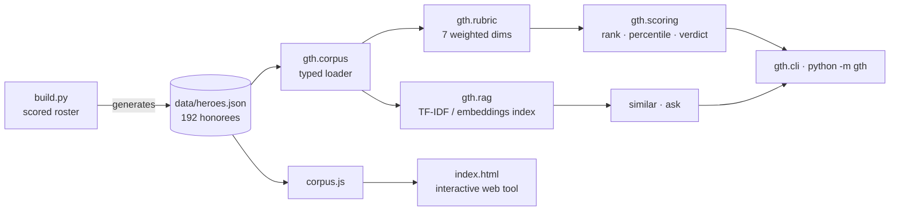

<div align="center">

# ▲ Glocal Teen Hero — At-Selection Benchmark

**An open, reproducible benchmark of every Glocal Teen Hero (Nepal) honoree, 2015–2025 — scored on the record they held _at selection_, with a retrieval (RAG) layer over the corpus.**

[](tests/) [](pyproject.toml) [](pyproject.toml) [](LICENSE) [](data/heroes.json)

[Live tool](https://arjanchaudharyy.github.io/glocal-teen-hero-benchmark/) · [Dataset card](DATA_CARD.md) · [Methodology](#methodology)

</div>

---

## Why this exists

Every year the Glocal Teen Hero program selects Nepal's boldest teen changemakers. The obvious question for any applicant — *"do I actually measure up to past honorees?"* — is usually answered with vibes. This answers it with a **corpus, a documented rubric, and code you can run.**

The one rule that makes it fair: **everyone is scored on the record they held _at the time they were selected_** — the teen record the jury saw — **not** the career they built in the years since. A current 15-year-old shouldn't be measured against someone's post-award Stanford/startup decade. Each honoree also carries a separate `now` note so the "where are they today" story is preserved but kept out of the scoring.

## Architecture



Two surfaces over one corpus: a **Python package** (`gth`) for ranking + retrieval, and a **zero-build web app** (`index.html`) that embeds the same data.

## Quickstart

```bash
git clone https://github.com/arjanchaudharyy/glocal-teen-hero-benchmark
cd glocal-teen-hero-benchmark

python -m gth rank                          # the at-selection leaderboard
python -m gth stats                         # cohort statistics by tier
python -m gth similar "Rahul Ranjan Sah"    # nearest honorees (RAG)
python -m gth ask "who worked on menstrual health?"   # retrieval-augmented answer
python -m gth score --file me.json          # score your own record
python -m unittest discover -s tests        # 11 tests, zero deps
```

**No dependencies for the core** — it's pure standard library, so it runs anywhere Python 3.9+ does.

## The RAG layer

Each honoree's at-selection record is a document; `gth.rag` builds a vector index and retrieves the most similar honorees to a free-text query or to another honoree.

- **Default backend — `tfidf`:** a pure-Python TF-IDF vectorizer with smoothed IDF, L2-normalized sparse vectors, and exact cosine. The corpus is ~192 docs, so exact search is instant and fully interpretable — no ANN index, no dependencies.
- **Optional backend — `embeddings`:** if `sentence-transformers` is installed, set `GTH_BACKEND=embeddings` to swap in `all-MiniLM-L6-v2` dense embeddings. The interface is identical; it degrades gracefully to TF-IDF when the library is absent.

```python
from gth import build_index, ask, similar
idx = build_index()                          # auto-selects backend
idx.query("robotics and hardware", k=5)      # -> [Retrieval(hero, score), ...]
print(ask("climate and environment", k=3))   # grounded, cite-by-name answer
```

`ask()` returns the retrieved evidence formatted as a grounded answer; pass the same context block to any LLM to make it generative — the retrieval layer is what keeps it honest.

## Methodology

**Seven weighted dimensions** (see `gth/rubric.py`), summing to 1.0:

| Dimension | Weight | | Dimension | Weight |
|---|---:|---|---|---:|
| Social impact | 0.20 | | Recognition | 0.10 |
| Leadership | 0.20 | | Glocal fit | 0.10 |
| Innovation | 0.15 | | Character | 0.10 |
| Entrepreneurship | 0.15 | | | |

Each honoree is scored 0–5 per dimension on their **at-selection** record; `weighted_total` produces a 0–5 score; `scoring.py` derives rank, winner-percentile, and a verdict. Weights are a documented prior — change them in `rubric.py` and re-run; the ranking is a pure function of the data plus the rubric.

See the [**dataset card**](DATA_CARD.md) for schema, labeling protocol, and confidence flags.

## Project layout

```
gth/
├── rubric.py     # dimensions + weights + weighted_total
├── corpus.py     # typed loader (Hero, Corpus dataclasses)
├── scoring.py    # rank_all, cohort_stats, percentile, verdict
├── rag.py        # TF-IDF index (+ optional embeddings) : similar, ask
├── cli.py        # `python -m gth ...`
build.py          # regenerates data/heroes.json + corpus.js from the scored roster
data/heroes.json  # the corpus (192 honorees)
index.html        # interactive web app (embeds corpus.js)
tests/            # unittest suite (stdlib)
```

## Reproducibility

`python build.py` regenerates the corpus and the web bundle deterministically from the scored roster in `build.py`; `python -m unittest discover -s tests` verifies corpus integrity, the rubric invariant (weights sum to 1), ranking order, and retrieval relevance. No network, no randomness, no hidden state.

## Honesty & limitations

- Scores reflect **public information + a documented rubric**, not the jury's decision. This is a self-assessment tool built by a 2026 applicant, and says so.
- Labels are judgment-based; low-footprint honorees are conservative estimates (`est=true`).
- `now` trajectories are context only and are **excluded** from scoring.
- Not affiliated with Glocal Pvt. Ltd. Corpus facts belong to their linked sources.

## Roadmap

- [ ] Swap TF-IDF default for cached MiniLM embeddings when a lockfile is present
- [ ] `gth serve-api` (FastAPI) exposing `/score`, `/similar`, `/ask`
- [ ] Inter-rater agreement study on a held-out sample of honorees

## License

MIT — see [LICENSE](LICENSE).
