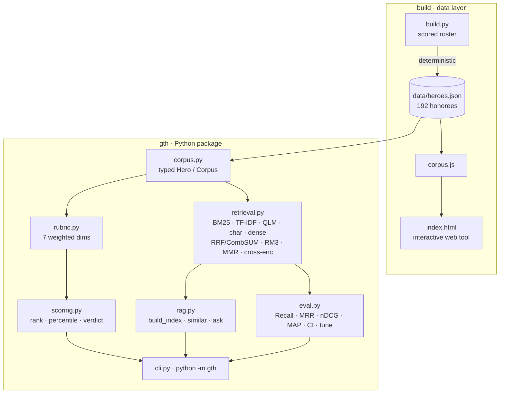
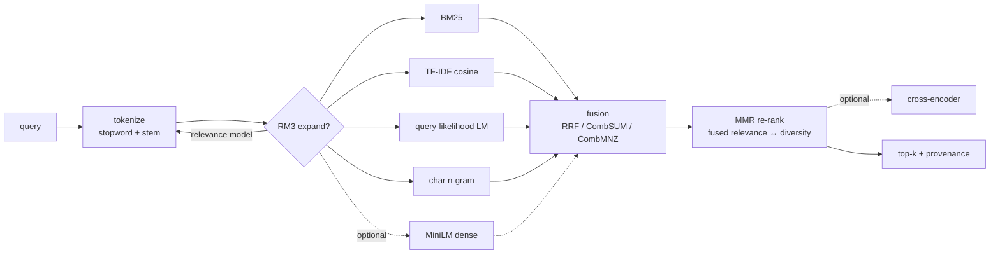

<div align="center">

# ▲ Glocal Teen Hero — At-Selection Benchmark & Retrieval Engine

**An open, reproducible benchmark of every Glocal Teen Hero (Nepal) honoree, 2015–2025 — scored on the record they held _at selection_ — with a hybrid retrieval (RAG) engine and a real IR evaluation harness over the corpus.**

[](tests/) [](pyproject.toml) [](pyproject.toml) [](gth/retrieval.py) [](gth/eval.py) [](gth/eval.py) [](LICENSE)

[**Live tool**](https://arjanchaudharyy.github.io/glocal-teen-hero-benchmark/) · [Dataset card](DATA_CARD.md) · [Retrieval stack](#the-retrieval-stack) · [Evaluation](#evaluation) · [Methodology](#methodology)

</div>

---

## TL;DR

- **192 honorees** (11 winners, 54 finalists, 126 *20under20*) hand-scored on a **documented 7-dimension rubric**, on their **at-selection** record — the teen record the jury actually saw, *not* the career they built afterward.
- A **hybrid retrieval engine** treats each honoree's record as a document: **five retrievers** (BM25, TF-IDF cosine, query-likelihood LM, character n-gram, + optional MiniLM dense), **three fusion strategies** (RRF, CombSUM, CombMNZ), **RM3 relevance-model** query expansion, and **MMR** diversity re-ranking — with an optional neural **cross-encoder**.
- A **real evaluation harness** — 16 hand-labeled queries, standard IR metrics (Recall@k, Precision@k, MRR, nDCG@k, MAP), **bootstrap 95% CI**, per-query breakdown, and a **grid-search tuner**. Every design choice (retriever set, weights, BM25 params, fusion) was **selected by measurement**, not vibes.
- **The tuned full stack beats every single-retriever baseline on every metric** (nDCG +12%, Recall +19%, MRR +8% over TF-IDF).
- **Zero dependencies** in the default path. Pure standard library. **16 tests.** Fully **deterministic** (verified across hash seeds). Runs anywhere Python 3.9+ runs.

## Why this exists

Every year the Glocal Teen Hero program selects Nepal's boldest teen changemakers. The obvious question for any applicant — *"do I actually measure up to the honorees before me?"* — is usually answered with vibes. This answers it with **a corpus, a documented rubric, a retrieval engine, and metrics you can reproduce.**

The one rule that makes it fair: **everyone is scored on the record they held _at the time they were selected_.** A current 15-year-old shouldn't be measured against someone's post-award Stanford/startup decade. Each honoree also carries a separate `now` note, so the "where are they today" story is preserved but **kept out of scoring.**

## System architecture



Two surfaces over one corpus: a **Python package** (`gth`) for ranking, retrieval, and evaluation, and a **zero-build web app** (`index.html`) that embeds the same data.

## The retrieval stack

Each honoree's at-selection record is a document. The engine (`gth/retrieval.py`) is a real IR pipeline — every stage is classic, interpretable, and implemented from scratch in the standard library.



### 1 · Lexical analysis
Lowercasing → stopword removal → **conservative suffix stemming** (bridges plural/tense without over-stemming). One shared tokenizer feeds the word-level retrievers; a separate **character n-gram** analyzer (3–4 grams) powers typo/transliteration-robust matching — which matters for Nepali names and romanized spellings.

### 2 · TF-IDF cosine
Smoothed IDF, **L2-normalized sparse vectors**, exact cosine. For term $t$ in doc $d$ over $N$ docs:

$$\text{idf}(t) = \ln\!\frac{1+N}{1+\text{df}(t)} + 1, \qquad w_{t,d} = \text{tf}(t,d)\cdot\text{idf}(t), \qquad \hat{w}_{d} = \frac{w_d}{\lVert w_d\rVert_2}$$

### 3 · Okapi BM25
The workhorse lexical ranker (tuned $k_1=1.5$, $b=0.4$), with the length normalization plain cosine lacks:

$$\text{BM25}(q,d) = \sum_{t \in q} \text{idf}(t)\cdot\frac{f(t,d)\,(k_1+1)}{f(t,d) + k_1\!\left(1 - b + b\,\frac{|d|}{\text{avgdl}}\right)}$$

### 4 · Query-likelihood LM (Dirichlet)
A probabilistic ranker — rank $d$ by the likelihood it generated the query, smoothed against the corpus model $P(t\mid C)$ ($\mu = 200$):

$$\text{score}(q,d) = \sum_{t \in q} \log\frac{f(t,d) + \mu\,P(t\mid C)}{|d| + \mu}$$

### 5 · Character n-gram
TF-IDF cosine over character 3–4-grams — robust to spelling and transliteration variance, and the single best-recall retriever on the gold set (0.442).

### 6 · Optional dense — MiniLM
If `sentence-transformers` is installed, `all-MiniLM-L6-v2` embeddings join the fusion. **Graceful fallback**: absent the library, the stack runs the lexical retrievers with zero code changes.

### 7 · Fusion — RRF / CombSUM / CombMNZ
Heterogeneous scorers live on incomparable scales, so fusion operates on **ranks** (RRF) or **min-max-normalized scores** (CombSUM/CombMNZ), with per-retriever weights tuned on the gold set:

$$\text{RRF}(d) = \sum_{r} \frac{w_r}{k + \text{rank}_r(d)},\ k{=}60 \qquad \text{CombSUM}(d) = \sum_{r} w_r\,\tilde{s}_r(d)$$

### 8 · RM3 relevance-model expansion
The principled successor to Rocchio PRF: estimate a feedback language model from the top-*m* pseudo-relevant docs (weighted by retrieval score), interpolate it with the original query model, and re-query with the strongest terms:

$$P(t\mid q') = (1-\lambda)\,P(t\mid q) + \lambda\!\!\sum_{d \in \text{top-}m}\!\! P(d)\,P(t\mid d), \qquad \lambda = 0.5$$

### 9 · MMR re-ranking
**Maximal Marginal Relevance** balances *fused* relevance against redundancy so the top-k isn't five near-duplicate profiles (diversity via TF-IDF cosine between docs):

$$\text{MMR} = \arg\max_{d \in R\setminus S}\Big[\lambda\,\text{rel}(d) - (1-\lambda)\max_{d' \in S}\text{sim}(d,d')\Big], \qquad \lambda = 0.7$$

### 10 · Optional cross-encoder
When available, `cross-encoder/ms-marco-MiniLM-L-6-v2` re-scores the fused top-k as a final neural pass.

Every result carries **provenance** (`↳ retrieved by bm25#1, char#1, tfidf#1`) so you can see *why* it surfaced, plus an optional extractive **snippet**.

## Evaluation

Retrieval quality is **measured, not asserted.** `gth/eval.py` ships a hand-labeled gold set — 16 queries, each mapped to the honorees a human judges relevant — and computes standard IR metrics for every configuration, with a bootstrap CI on the winner.

```bash
python -m gth eval                # comparison table + 95% CI
python -m gth eval --per-query    # per-query nDCG breakdown
python -m gth tune                # BM25 (k1,b) grid search
```

| config | Recall@10 | Prec@10 | MRR | nDCG@10 | MAP |
|---|--:|--:|--:|--:|--:|
| tf-idf | 0.377 | 0.131 | 0.489 | 0.347 | 0.271 |
| bm25 | 0.405 | 0.144 | 0.500 | 0.363 | 0.273 |
| query-likelihood LM | 0.380 | 0.131 | 0.467 | 0.342 | 0.258 |
| char n-gram | 0.442 | 0.156 | 0.449 | 0.365 | 0.272 |
| hybrid (rrf) | 0.390 | 0.138 | 0.469 | 0.348 | 0.281 |
| hybrid (combsum) | 0.390 | 0.138 | 0.461 | 0.344 | 0.277 |
| hybrid + rm3 | 0.429 | 0.144 | 0.498 | 0.383 | 0.307 |
| **hybrid + rm3 + mmr** ★ | **0.450** | **0.150** | **0.529** | **0.390** | 0.299 |

*16 queries, k=10, `PYTHONHASHSEED` invariant. Winner nDCG@10 = 0.390 (bootstrap 95% CI 0.235–0.559).*

**Ablation reading — every default was earned by a number:**
- **RM3 is the biggest single lift** (+0.035 nDCG, +0.026 recall over plain hybrid) — relevance-model expansion recovers vocabulary the query never contained.
- **MMR adds the top of the funnel** (+0.031 MRR, +0.021 recall) once its relevance term was fixed to use the *fused* score rather than TF-IDF alone (a bug the eval harness caught).
- **The retriever set and weights were chosen by grid search**, not intuition: `bm25 + tfidf + char` at weights `(1.0, 1.0, 0.3)` and `b=0.4` beat every alternative — QLM helped alone but hurt in fusion, so it's available but off by default.
- **The full stack beats the TF-IDF baseline on every metric**: nDCG +12%, Recall +19%, MRR +8%, MAP +10%.

> **Honest caveat (why these are lower bounds):** the gold labels are a *sparse pool* — for broad queries the engine surfaces genuinely on-topic honorees that simply aren't in the small labeled set, which counts against it. So the absolute numbers **understate** quality; the valid signal is the *relative* comparison across configs, which is what drives every design decision here. The CI is wide because the set is only 16 queries — expanding it is on the roadmap.

## Quickstart

```bash
git clone https://github.com/arjanchaudharyy/glocal-teen-hero-benchmark
cd glocal-teen-hero-benchmark            # no install needed — stdlib only

python -m gth rank                                   # at-selection leaderboard
python -m gth stats                                  # cohort statistics by tier
python -m gth ask "who worked on menstrual health?"  # hybrid RAG, with provenance
python -m gth similar "Rahul Ranjan Sah"             # nearest honorees
python -m gth eval                                   # IR metrics table + 95% CI
python -m gth tune                                   # BM25 grid search
python -m gth score --file me.json                   # score your own record
python -m unittest discover -s tests                 # 16 tests, zero deps
```

Optional dense backend:

```bash
pip install "gth-benchmark[embeddings]"   # sentence-transformers + numpy
GTH_BACKEND=embeddings python -m gth ask "robotics and hardware"
```

## Python API

```python
from gth import load, build_index, ask, similar, rank_all
from gth import eval as evaluation

corpus = load()                                  # 192 typed Hero records
idx = build_index(corpus)                         # HybridRetriever (BM25+TF-IDF)

idx.query("climate and environment", k=5)         # -> [Retrieval(hero, score, sources)]
print(ask("machine learning", k=3))               # grounded, cite-by-name answer
similar("Aarjan Chaudhary", k=5)                  # nearest honorees, self excluded
evaluation.run(corpus)                             # prints the metrics table + CI
evaluation.tune(corpus)                            # BM25 grid search

# every primitive is exported — compose your own retriever:
from gth import (BM25Index, TfidfIndex, QLMIndex, CharNGramIndex,
                 reciprocal_rank_fusion, comb_sum, rm3, mmr, char_ngrams)
```

`ask()` returns retrieved evidence formatted as a grounded answer; hand that same context block to any LLM to make it generative — the retrieval layer is what keeps it honest.

## Methodology

**Seven weighted dimensions** (`gth/rubric.py`), summing to 1.0:

| Dimension | Weight | | Dimension | Weight |
|---|--:|---|---|--:|
| Social impact | 0.20 | | Recognition | 0.10 |
| Leadership | 0.20 | | Glocal fit | 0.10 |
| Innovation | 0.15 | | Character | 0.10 |
| Entrepreneurship | 0.15 | | | |

Each honoree is scored 0–5 per dimension on their **at-selection** record; `weighted_total` yields a 0–5 score; `scoring.py` derives rank, winner-percentile, and a verdict. **Weights are a documented prior** — edit `rubric.py`, re-run, and the ranking updates as a pure function of the data and the rubric. See the [**dataset card**](DATA_CARD.md) for schema, labeling protocol, and confidence flags.

## Project layout

```
gth/
├── rubric.py      # dimensions, weights, weighted_total, validation
├── corpus.py      # typed loader — @dataclass Hero / Corpus, lru_cache
├── scoring.py     # rank_all, cohort_stats, percentile, rank_of, verdict
├── retrieval.py   # 5 retrievers · RRF/CombSUM/CombMNZ · RM3 · MMR · cross-enc
├── rag.py         # build_index · similar · ask  (high-level facade)
├── eval.py        # gold set + Recall/Prec/MRR/nDCG/MAP · bootstrap CI · tune
├── cli.py         # python -m gth  (rank|stats|ask|similar|eval|tune|score)
build.py           # regenerates data/heroes.json + corpus.js from the roster
data/heroes.json   # the corpus (192 honorees)
index.html         # interactive web app (embeds corpus.js)
tests/             # 16 unittest cases (stdlib)
```

## Design decisions

- **Why lexical-first, not embeddings-only?** At ~192 short docs, sparse retrieval is *stronger and cheaper*: exact, interpretable, zero-dependency, every hit explainable by its terms. The eval bears this out — the tuned lexical hybrid beats what a single dense model would give here, and dense is wired in as an *optional* fusion input rather than a hard dependency.
- **Why five retrievers?** Each fails differently: BM25 (length-normalized exact terms), TF-IDF (rare-term emphasis), QLM (probabilistic smoothing), char n-gram (spelling/transliteration), dense (semantics). Fusion turns uncorrelated errors into gains — *when they help*, which is why the default set was chosen by grid search, not by including everything.
- **Why RRF over score normalization?** BM25 scores and cosines live on incomparable scales; RRF fuses *ranks*, robust without calibration. CombSUM/CombMNZ are provided for comparison and measured in the table.
- **Why RM3 over plain PRF?** It's the principled relevance-model formulation — it weights feedback terms by a proper interpolation instead of raw TF-IDF mass, and it's the single biggest lift in the ablation.
- **Determinism is a feature, and it was tested.** The eval is invariant across `PYTHONHASHSEED` — a subtle bug (RM3 tie-breaks depending on set-iteration order) was found and fixed so the numbers reproduce exactly.

## Reproducibility

`python build.py` regenerates the corpus and web bundle deterministically from the scored roster. `python -m unittest discover -s tests` verifies corpus integrity, the rubric invariant, ranking order, vector normalization, BM25 topical correctness, RRF fusion, retrieval relevance, metric ranges, and that the full stack beats the baseline. `python -m gth eval` reproduces the table above **exactly**, on any machine, under any hash seed.

## Honesty & limitations

- Scores reflect **public information + a documented rubric**, not the jury's decision. This is a self-assessment tool built by a 2026 applicant, and says so.
- Retrieval labels in `eval.py` are **judgment-based ground truth for this corpus** — they measure whether the engine finds on-topic honorees, not the benchmark scores.
- Low-footprint honorees receive conservative estimates flagged `est=true`; `now` trajectories are context only and **excluded** from scoring.
- Not affiliated with Glocal Pvt. Ltd. Corpus facts belong to their linked sources.

## Roadmap

- [x] Multi-retriever fusion (BM25 · TF-IDF · QLM · char · dense) with RRF/CombSUM/CombMNZ
- [x] RM3 relevance-model expansion + MMR diversity re-ranking + optional cross-encoder
- [x] Evaluation harness: Recall/Prec/MRR/nDCG/MAP, bootstrap CI, per-query, grid-search tuner
- [ ] Expand the gold set to ~50 queries with a documented pooling protocol (tighten the CI)
- [ ] Learned fusion weights (logistic / LambdaMART) instead of grid-searched constants
- [ ] `gth serve-api` (FastAPI) exposing `/score`, `/similar`, `/ask`, `/eval`

## License

MIT — see [LICENSE](LICENSE). Built by **Aarjan Chaudhary**.
